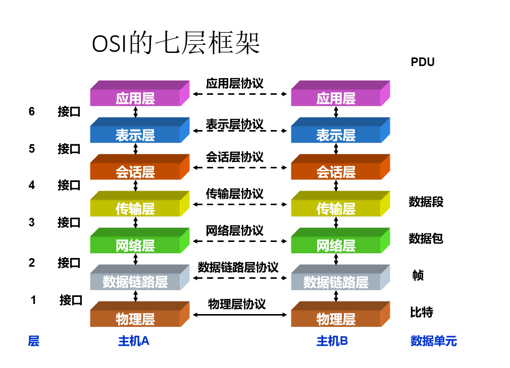
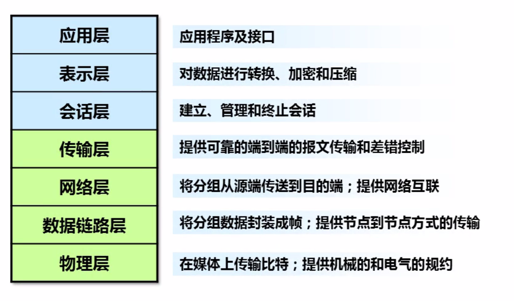
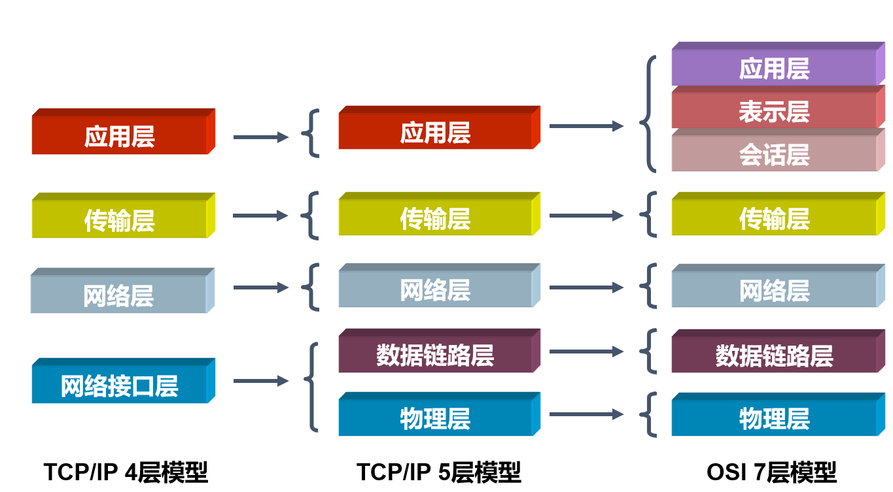
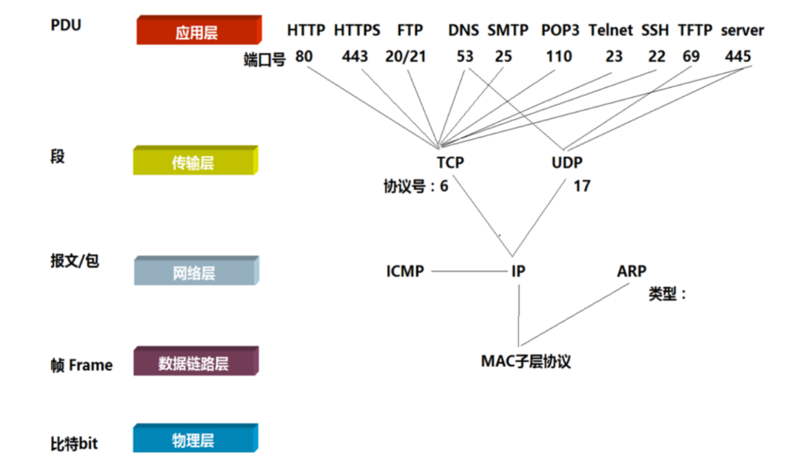
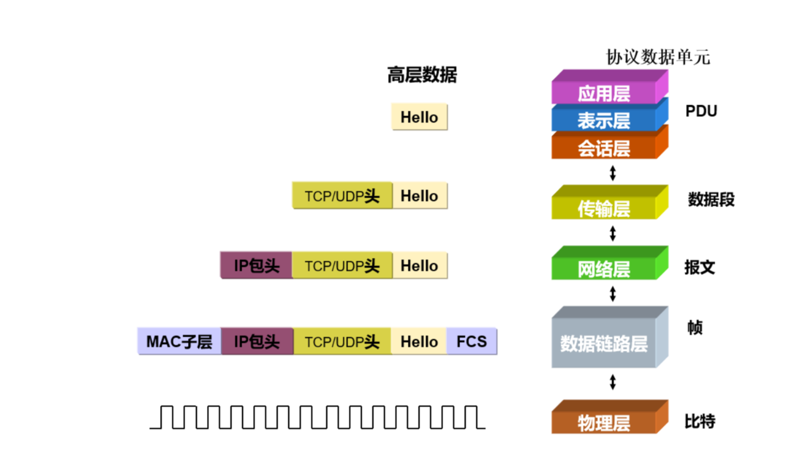
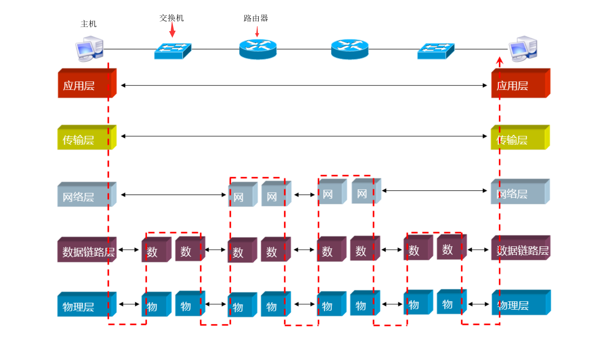

# 网络与协议概述

> 为什么搭载不同系统的各种设备可以通信？他们是怎么通信的？协议是干嘛用的？有多少种协议？常见的断网攻击原理又是什么？

## 协议

为了使数据可以在网络上从源传递到目的地，网络上所有设备需要“讲”相同的“语言”

### 数据通信协议的定义

决定数据的格式和传输的一组规则或者一组惯例

### 网络通信的过程很复杂

- 数据以电子信号的形式穿越介质到达正确的计算机，然后转换成最初的形式，以便接收者能够阅读
- 为了降低网络设计的复杂性，将协议进行了分层设计

## OSI七层模型

### 分层设计的意义

- 用户服务层的模块设计可相对独立于具体的通信线路和通信硬件接口的差别

- 而通信服务层的模块设计又可想对于具体用户应用要求的不同

  > 例如：文件传输或电子邮件服务模块的设计，不必关心底层通信线路是光纤还是双绞线

### 服务

- 是网络中各层向其相邻上层提供的一组操作

### 服务访问点（SAP）

- N+1层实体是通过N层的SAP来使用N层所提供的服务
- SAP相当于相邻层之间的接口

### OSI七层模型设计理念

- 建立七层模型的主要目的是为解决异种网络互连时所遇到的兼容性问题
- 它的最大优点是将服务、接口和协议这三个概念明确地区分开来
- 服务：某一层为上一层提供一些什么功能
- 接口：上一层如何使用下层的服务
- 协议：如何实现本层的服务
- 这样各层之间具有很强的独立性，互连网络中各实体采用什么样的协议是没有限制的，只要向上提供相同的服务并且不改变相邻层的接口就可以了

### 网络分层结构的好处

- 网络七层的划分也是为了使网络功能模块（不同层次）分担起不同的职责，从而带来如下好处
- 减轻问题的复杂程度，一旦网络发生故障，可迅速定位故障所处层次，便于查找和纠错
- 在各层分别定义标准接口，使具有相同对等层的不同网络设备能实现互操作，各层之间则相对独立，一种高层协议可放在各种低层协议上运行
- 能有效刺激网络技术革新，因为每次更新都可以在小范围内进行，不需要对整个网络动大手术
- 便于研究和教学

## TCP-IP协议栈

## 封装与解封装

## 数据流测传输

