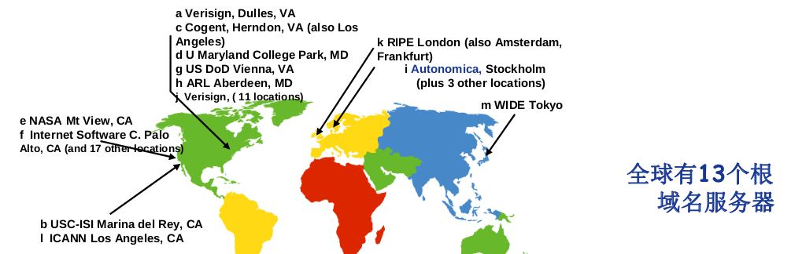

# DNS（Domain Name System）

- Internet上主机/路由器的识别问题
  - IP地址
  - 域名:www.ccnoob.com

- 问题:域名和IP地址之间如何映射?
- 域名解析系统DNS
  - 多层命名服务器构成的分布式数据库
  - 应用层协议:完成名字的解析
    - Internet核心功能,用应用层协议实现
    - 网络边界复杂

## DNS服务

- 域名向IP地址的翻译
- 主机别名
- 邮件服务器别名
- 负载均衡:Web服务器

## 为什么不使用集中式的DNS?

- 单点失败问题
- 流量问题

- 距离问题
- 维护性问题

## 分布式层次式数据库


- 客户端想要查询www.amazon.com的IP
  - 客户端查询根服务器,找到com域名解析服务器
  - 客户端查询com域名解析服务器,找到amazon.com域名解析服务器
  - 客户端查询amazon.com域名解析服务器,获得www.amazon.com的IP地址

## DNS根域名服务器

- 本地域名解析服务器无法解析域名时,访问根域名服务器
- 根域名服务器
  - 如果不知道映射,访问权威域名服务器
  - 获得映射
  - 向本地域名服务器返回映射



## TLD和权威域名解析服务器

- 顶级域名服务器(TLD, top-level domain): 负责com, org, net,edu等顶级域名和国家顶级域名,例如cn, uk, fr等
  - Network Solutions维护com顶级域名服务器
  - Educause维护edu顶级域名服务器
- 权威(Authoritative)域名服务器:组织的域名解析服务器,提供组织内部服务器的解析服务
  - 组织负责维护
  - 服务提供商负责维护

## 本地域名解析服务器

- 不严格属于层级体系
- 每个ISP有一个本地域名服务器
  - 默认域名解析服务器
- 当主机进行DNS查询时,查询被发送到本地域名服务器
  - 作为代理(proxy),将查询转发给(层级式)域名解析服务器系统


## DNS查询示例

- 迭代查询
  - 被查询服务器返回域名解析服务器的名字
  - 我不认识这个域名,但是你可以问这服务器


- 递归查询
  - 将域名解析的任务交给所联系的服务器


## DNS记录缓存和更新

- 只要域名解析服务器获得域名—IP映射,即缓存这一映射
  - 一段时间过后,缓存条目失效(删除)
  - 本地域名服务器一般会缓存顶级域名服务器的映射
    - 因此根域名服务器不经常被访问
- 记录的更新/通知机制
  - RFC 2136
  - Dynamic Updates in the Domain Name System (DNS UPDATE)

## DNS记录

- Type=A
  - Name: 主机域名
  - Value: IP地址
- Type=NS
  - Name: 域(edu.cn)
  - Value: 该域权威域名解析服务器的主机域名
- Type=CNAME
  - Name: 某一真实域名的别名
    - www.ibm.com –servereast.backup2.ibm.com
  - Value: 真实域名
- Type=MX
  - Value是与name相对应的邮件服务器

## DNS协议与消息


- DNS协议
  - 查询(query)和回复(reply消息)
  - 消息格式相同
- 消息头部
  - Identification: 16位查询编号,回复使用相同的编号
  - flags
    - 查询或回复
    - 期望递归
    - 递归可用
    - 权威回答

## 如何注册域名

- 例子:你刚刚创建了一个公司 “ccnoob”

- 在域名管理机构(如Network Solutions)注册域名ccnoob.com

  - 向域名管理机构提供你的权威域名解析服务器的名字和IP地址

  - 域名管理机构向com顶级域名解析服务器中插入两条记录

    ```bash
    (ccnoob.com,		dns1.ccnoob.com		NS)
    (dns1.ccnoob.com,		100.100.100.1,		A)
    ```

- 在权威域名解析服务器中为www.ccnoob.com 加入Type A记录,为ccnoob.com加入Type MX记录