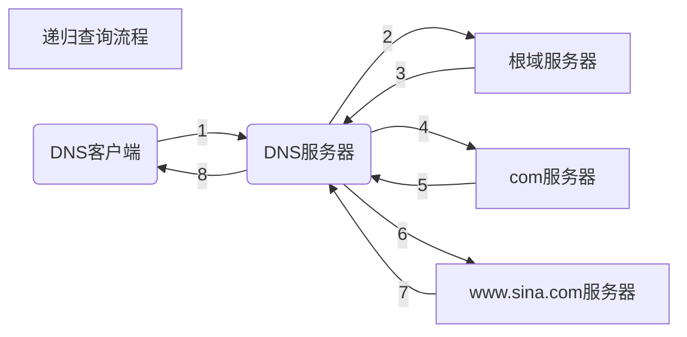

# 被动信息收集

- 公开渠道可获得的信息

- 与目标系统不产生直接交互

- 尽量避免留下一切痕迹

- OSINT（公开资源情报计划）

  [美国军方]: https://fas.org/irp/doddir/army/atp2-22-9.pdf
  [北大西洋公约组织]: http://information-retrieval.info/docs/NATO-OSINT.html

## 信息收集内容

- IP地址段
- 域名信息
- 邮件地址
- 文档图片数据
- 公司地址
- 公司组织架构
- 联系电话 / 传真号码
- 人员姓名 / 职务
- 目标系统使用的技术架构
- 公开的商业信息

## 信息用途

- 用信息描述目标
- 发现
- 社会工程学攻击
- 物理缺口

## 信息收集DNS

- 域名解析成IP地址
  - 域名与FQDN的区别
  - 域名记录：A、Cname、NS、MX、NS



## NSLOOKUP（跨平台）

```bash
nslookup	www.sina.com

set type=a、mx、ns、any

nslookup -type=ns example.com 156.154.70.22
nslookup -type=any sina.com 8.8.8.8
```

## DIG

```bash
dig sina.com any @8.8.8.8

# 筛选查询
dig mail.163.com any
dig +noall +answer mail.163.com any
dig +noall +answer mail.163.com any | awk '{print $5}'

# 反向域名解析
dig -x 8.8.8.8

# bind版本信息（只有黑客会感兴趣的一条命令）
dig +noall +answer txt chaos VERSION.BIND @ns3.dnsv4.com

# DNS追踪
dig +trace www.baidu.com
```

## DNS区域传输

```bash
# 通过抓包去分析
# 区域传输两种方式
dig @ns3.sina.com sina.com axfr
host -T -l sina.com ns3.sina.com
```

## DNS字典爆破

```bash
fierce -dnsserver 8.8.8.8 -dns sina.com.cn -wordlist a.txt
# dpkg -L fierce

dnsenum -f dnsbig.txt -dnsserver 8.8.8.8 sina.com.cn
dnsenum -f dnsbig.txt -dnsserver 8.8.8.8 sina.com.cn -o test.txt

dnsmap sina.com.cn -w dns.txt

dnsrecon -d sina.com.cn --lifetime 10 -t brt -D /usr/share/dnsrecon/namelist.txt
```

## DNS注册信息

```bash
whois sina.com
whois 8.8.8.8
whois -h whois.apnic.net 192.10.43.10
```

| AFRINIC | http://www.afrinic.net |
| ------- | ---------------------- |
| APNIC   | http://www.apnic.net   |
| ...     | ...                    |

