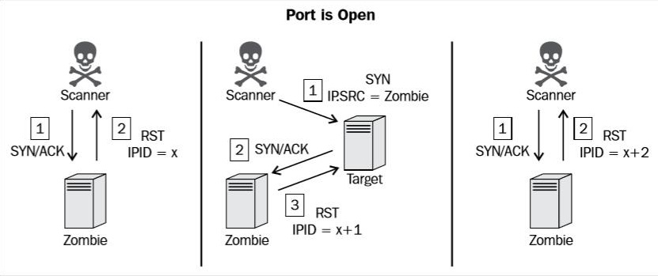

# 端口扫描

- 端口对应网络服务及应用端程序
- 服务端程序的漏洞通过端口攻入
- 发现开放的端口
- 更具体的攻击面

## UDP端口扫描

- scapy

- nmap

  ```bash
  # 默认的1000个常用端口
  # 主要基于ICMP host-unreachable
  nmap -sU 192.168.1.1
  
  # 指定端口
  nmap -sU 192.168.1.1 -p 666
  ```

## TCP端口扫描

> 基于连接的协议，所有的TCP扫描方式都是基于三次握手的变化来判断目标端口状态

- 全连接扫描
- 隐蔽扫描
- 僵尸扫描

### 隐蔽扫描(syn)

- 不建立完整连接
- 应用日志不记录扫描行为（隐蔽）

### 僵尸扫描

> 极度隐蔽，实施条件苛刻

- 可伪造源地址
- 选择僵尸机
  - 闲置系统
  - 系统使用递增的IPID
    - 0
    - 随机




